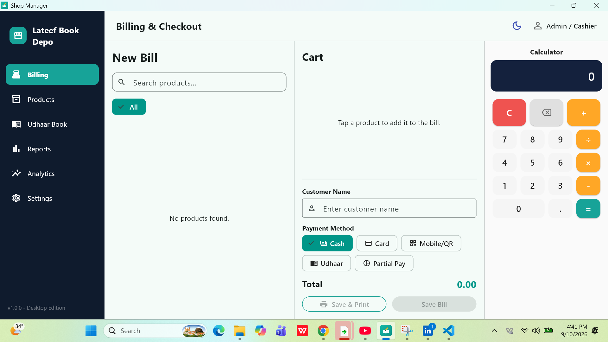
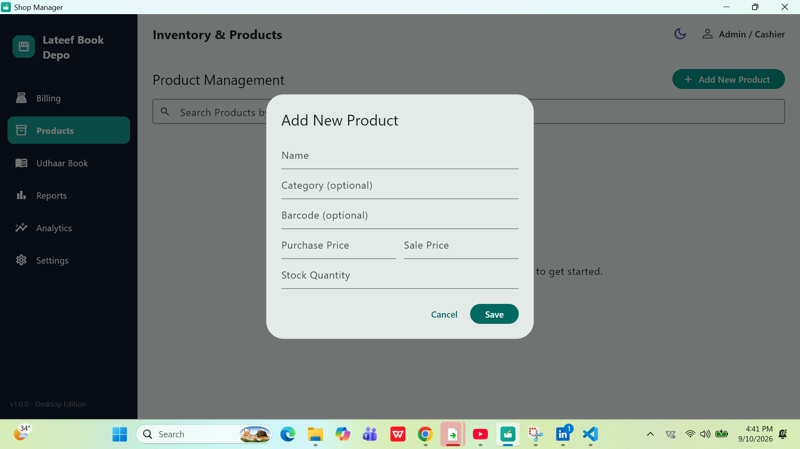

# Lateef Book Depo — Shop Manager

An offline-first Point of Sale, inventory, and Udhaar (credit) management system built in Flutter for a real stationary shop. Designed, developed, and delivered end-to-end as my first paid client project.

## Overview

Lateef Book Depo needed a way to move away from handwritten bills and manually tracked customer credit. This app replaces that entirely with a native Windows desktop application — no internet dependency, no subscriptions, running locally on the shop owner's own laptop.

## Features

- **Billing & Checkout** — searchable product grid, live cart, quantity adjustments, category filters
- **Multiple Payment Methods** — Cash, Card, Mobile/QR, Udhaar (credit), and Partial Pay
- **Udhaar (Credit) Ledger** — track customer dues, receive partial or full payments against open bills
- **Inventory Management** — product catalog with stock tracking and category organization
- **Receipt Printing** — thermal-printer-ready (80mm roll) receipt generation via PDF layout
- **Reports & Analytics** — sales history, profit tracking, and progress dashboards
- **Offline-First** — local SQLite database (via Drift), zero internet dependency
- **Database Backup & Restore** — JSON export/import for data safety
- **Light & Dark Mode**

## Tech Stack

- **Framework:** Flutter (Windows desktop)
- **Database:** Drift (SQLite)
- **PDF/Printing:** `printing` and `pdf` packages
- **Window Management:** `window_manager`
- **Packaging:** Inno Setup (Windows installer)

## Screenshots

<b>Click to view screenshots</b>

 

**Billing & Checkout**

**Products / Inventory**

**Udhaar Book (Credit Ledger)**

**Reports**

**Analytics**

**Analytics**

## Why This Project Matters to Me

I'm a first-year Computer Science student at PIEAS. This was the first time a real business trusted me with a real problem — and the first time I got paid for solving it. From requirements gathering, to development, to on-site installation and printer setup on the client's own laptop, this project was built and delivered entirely on my own.

---

Built by [Jamshaid Khan Niazi](https://jamshaidkhanniazi5965-ship-it.github.io) — Niazi Tech
